# DOM-0S
Operating system built from scratch with C

## PROGRESS IN PICS
### BOOT
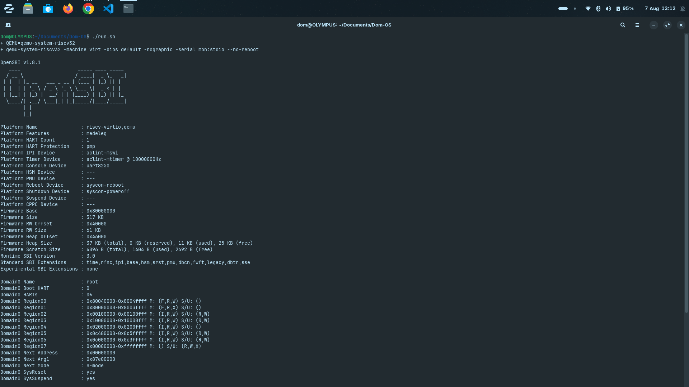
<br>
<br>

### KERNEL
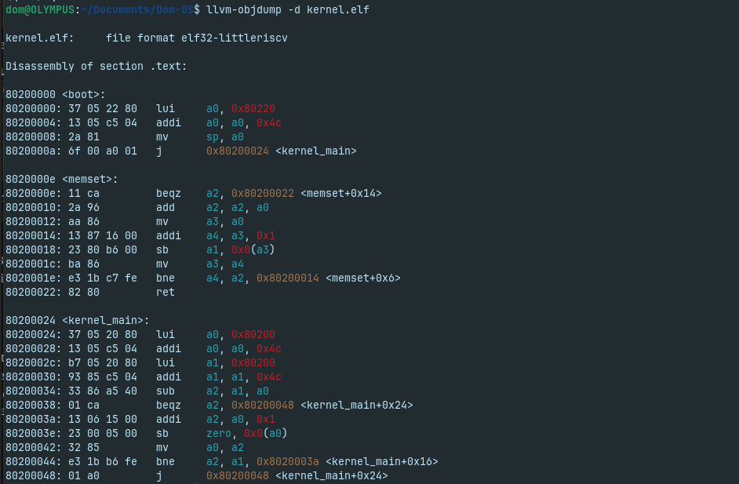
<br>
<br>

### OUTPUT
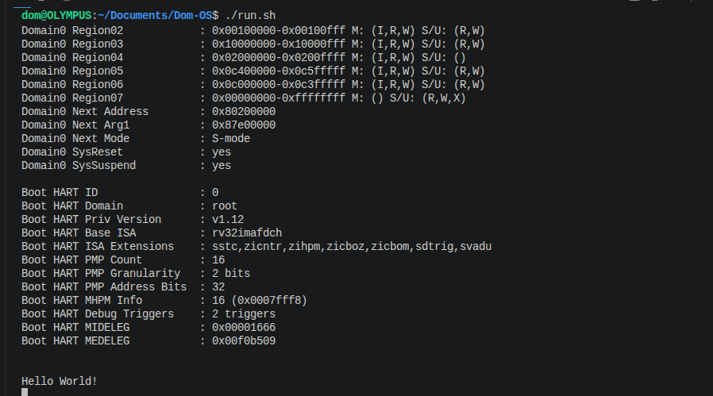
<br>
<br>

### CREATING PANIC
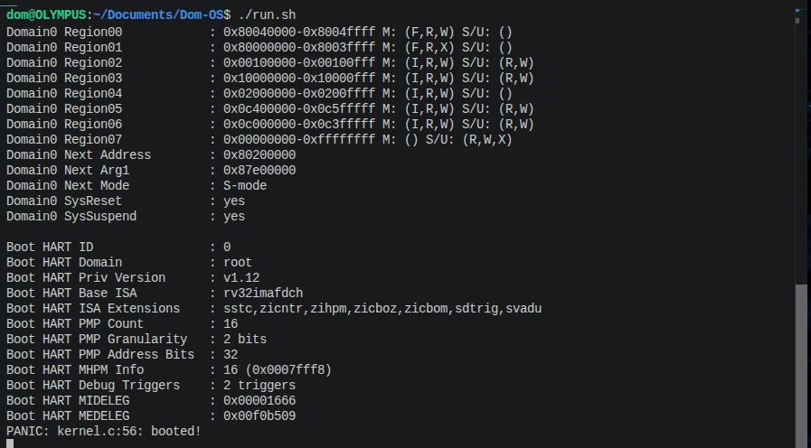
<br>
<br>

### EXCEPTION HANDLING
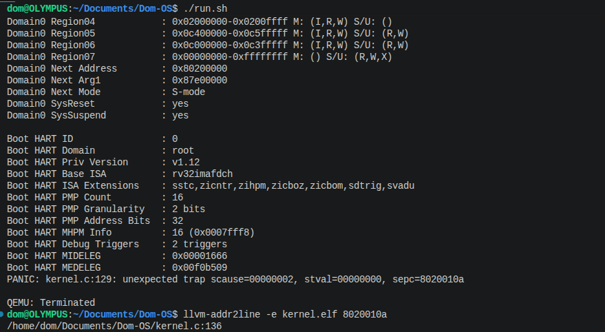
<br>
<br>

### MEMORY ALLOCATION
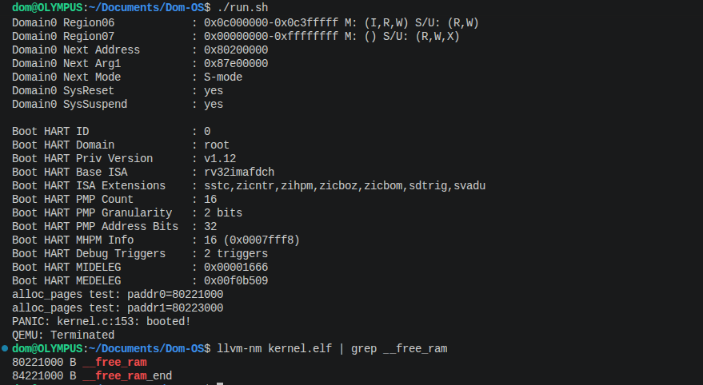
<br>
<br>

### PROCESS/CONTEXT SWITCHING
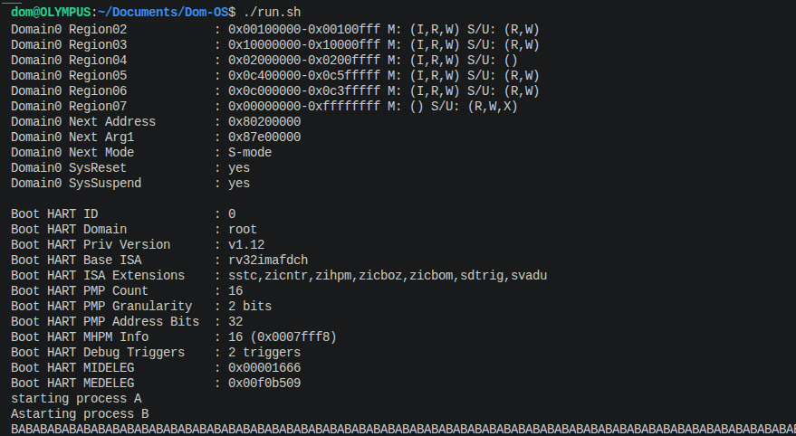
<br>
<br>

### PAGE TABLE
#### REGISTER INFO
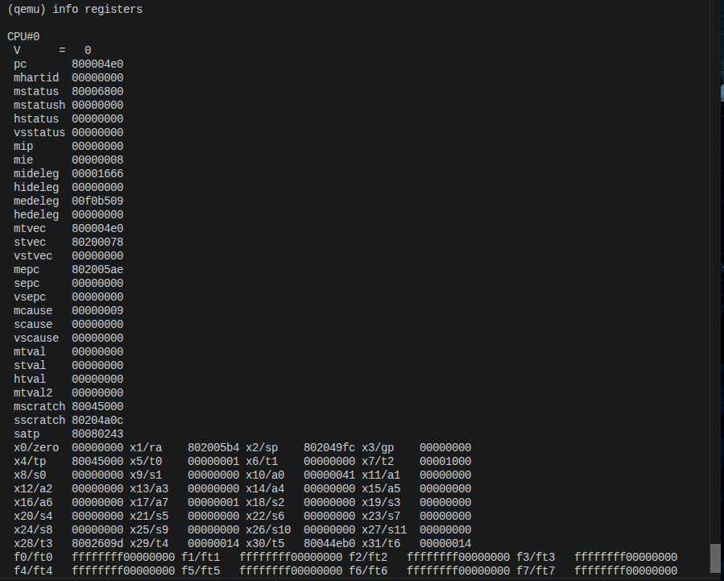

#### ACTUAL PAGE TABLE
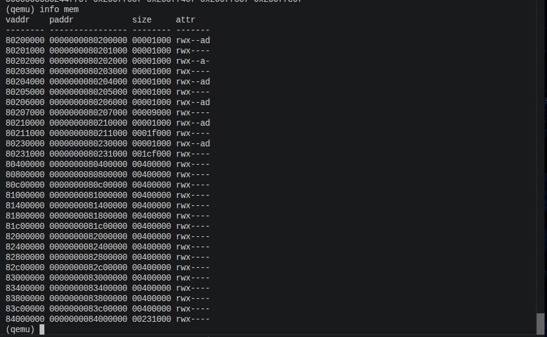
<br>
<br>

### APPLICATION
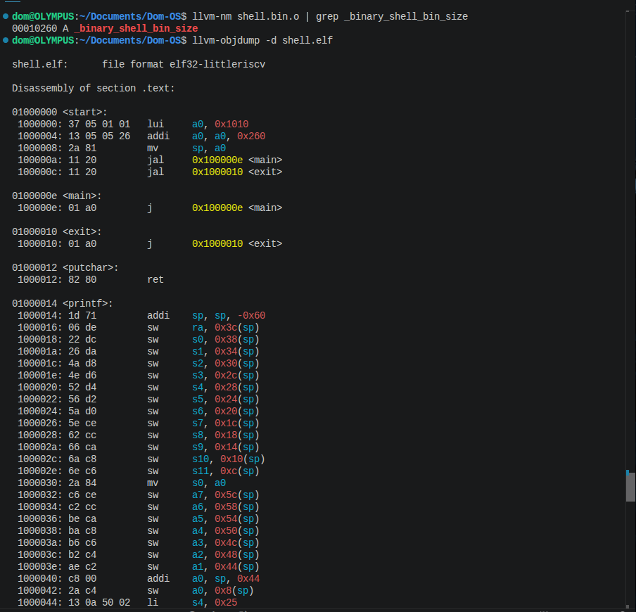
<br>
<br>

### USER MODE
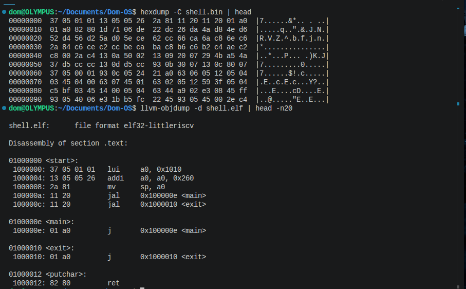

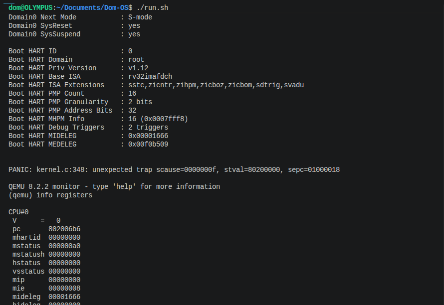
<br>
<br>

### SYSTEM CALL
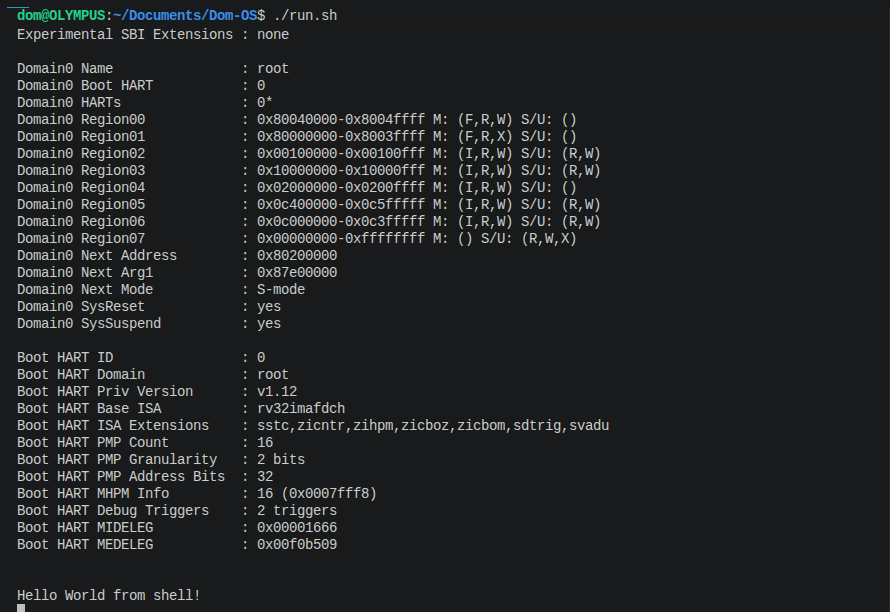

#### SENDING COMMANDS TO SHELL
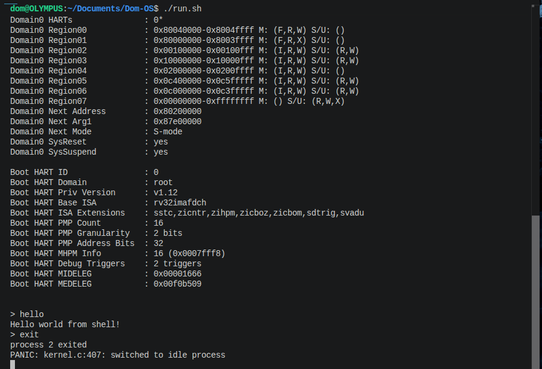
<br>
<br>

### DISK IO (READING FROM AND WRITING TO A DISK)
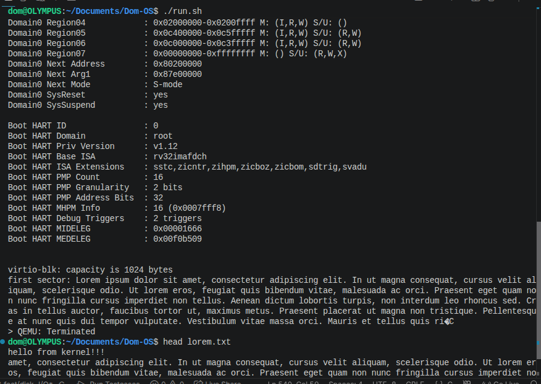
<br>
<br>

### FILE SYSTEM
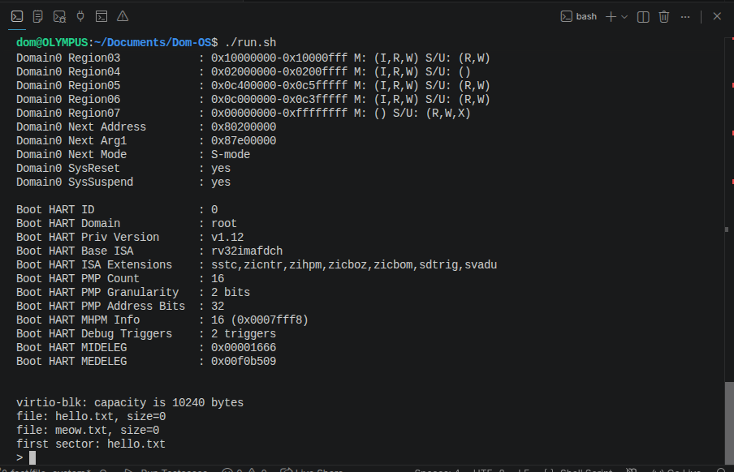

#### READING FROM AND WRITING TO FILES
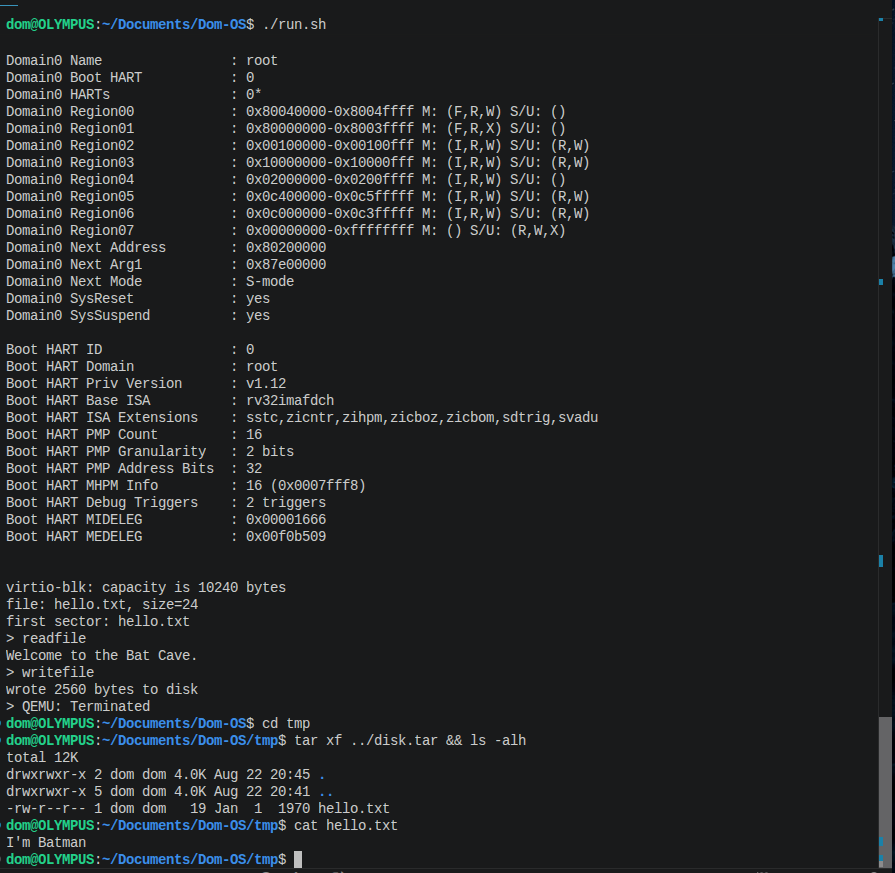
<br>
<br>

## CHALLENGES
### BOOT SECTION
**PROBLEM** 

./run.sh failed with

```console
qemu-system-riscv32: Unable to find the RISC-V BIOS "opensbi-riscv32-generic-fw_dynamic.bin"

```

**CAUSE** 

Ubuntu/Zorin's opensbi apt package only ships riscv64 firmware **(/usr/lib/riscv64-linux-gnu/opensbi/generic/fw_dynamic.bin)**, not riscv32.
 
**qemu-system-riscv32's -bios default** needs a 32-bit firmware binary, which doesn't exist anywhere on a stock Ubuntu/Zorin install.

**FIX**

 Downloaded the prebuilt 32-bit OpenSBI firmware directly from QEMU's own upstream repo, placing it in QEMU's default data search path (**/usr/share/qemu**, found via **qemu-system-riscv32 -L help**):

 ```bash
 sudo wget -O /usr/share/qemu/opensbi-riscv32-generic-fw_dynamic.bin \
  https://github.com/qemu/qemu/raw/master/pc-bios/opensbi-riscv32-generic-fw_dynamic.bin
 ```

 This let **-bios default** resolve correctly without modifying **run.sh** or any guide-provided files.
<br>
<br>
<br>

**DEVELOPED WITH ZORIN OS 18.1**
